# The films

A diagram is for a shape and a film is for an order. A control flow graph is a shape, so it gets a picture. The order the SSA renamer walks that graph in is not a shape, and the finished dump does not record it anywhere, so it gets a film.

There are six. Each one runs between sixty and ninety seconds, loops forever, and is built out of the same recorded dumps the lessons and the diagrams are built from, so when the pinned compiler moves the films move with it. Rebuild them with `just films`, and look at the lot on one page with `python -m gxmanim film --index --open`.

They are animated SVG rather than video, which is a deliberate departure from the spec. This project has no runtime dependencies and encoding video needs some. `gxmanim` was already an SVG renderer, so a film is the renderer it already has plus a stylesheet. And an SVG is text, which means a film diffs, is reproducible byte for byte, and can be checked by CI against the corpus it was drawn from, none of which is true of a WebM.

Every film degrades to one whole readable shot when animation is off or when a reader has asked for no motion. The paragraph above each one is its description, and the image itself carries no alt text, because a screen reader that finds the same sentences twice reads them twice.

This page is generated by `python -m gxmanim film`. Edit `gxmanim/films.py` rather than editing here.

## One line of C, growing a lane per level { #film-five-faces }

Three lines from a nine line C file each grow a lane at a time as they go down the pipeline, from GENERIC to GIMPLE to RTL to the assembly. The assignment on line 5 keeps roughly the same amount of work at every level. The loop header on line 6 is one line of C and picks up six pieces of RTL and six instructions. The return on line 8 has something at GENERIC and something at GIMPLE and then two empty lanes, because by the time the compiler is choosing instructions the value is already sitting in the register the function returns in.

{ loading=lazy }

12 shots, 72 seconds. Goes with [T02](https://github.com/tamnd/gcc-internals/blob/main/lessons/t02-five-faces/t02.ipynb).

## Seven C expressions, taken apart { #film-gimple-flattening }

Seven functions from the same file, each one line of C returning a different shape of expression, are shown with what gimplification made of them. The first is a single addition and comes out as two statements. Each one after it is a little less reasonable, and the lane of GIMPLE statements underneath gets longer while the line of C above it stays one line. The worst of them puts seven operators in one expression and comes out as eight statements in a row, and not one statement anywhere in the film has two operators in it.

{ loading=lazy }

7 shots, 63 seconds. Goes with [T03](https://github.com/tamnd/gcc-internals/blob/main/lessons/t03-gimple-is-c-with-the-fun-removed/t03.ipynb).

## Three hundred passes, and most of them leave the function alone { #film-pass-tape }

The pass tape for one small function at -O2 fills in a tenth at a time until all 281 cells are on screen. The 25 cells that changed the IR arrive in two clusters. The first runs from the early lowering passes through to release_ssa, the second covers the main optimizer run from vrp1 to crited1, and there is a gap of about fifty passes between them where nothing moved at all. After tree-optimized the tape goes quiet for good, because everything past that point is RTL and there is no GIMPLE dump left for the tape to compare.

{ loading=lazy }

10 shots, 70 seconds. Goes with [T04](https://github.com/tamnd/gcc-internals/blob/main/lessons/t04-three-hundred-and-ninety-five-passes/t04.ipynb).

## Renaming a function, one block at a time, in dominator order { #film-dominator-order }

The control flow graph of a nine block function, with one block lit at a time in the order an SSA renamer visits them. The walk goes ENTRY, then bb 2, then bb 7, then bb 3, where it fans out across the three blocks in the loop body before coming back for bb 8 and EXIT. That is neither the order the blocks are numbered in nor the order they are printed in the dump. Every block is reached only after the block that all paths to it have to go through, which is what makes it safe to rename in a single walk and is why the phi nodes end up at the top of bb 7.

{ loading=lazy }

9 shots, 68 seconds. Goes with [T05](https://github.com/tamnd/gcc-internals/blob/main/lessons/t05-ssa-in-one-lesson/t05.ipynb).

## Where the registers run out, on two machines { #film-pressure-ramp }

Five functions, each needing more values alive at once than the last, are added one lane at a time to a chart of register pressure. On x86-64, with fifteen registers to hand out, the lanes run off the end of the register file at the third function and the marks for values kept in memory start appearing. The chart then rebuilds for aarch64, which has thirty registers, and the same five functions fit until the very last one. Same source, same flags, same compiler, and the only thing that changed is how many registers the machine has.

{ loading=lazy }

10 shots, 70 seconds. Goes with [T08](https://github.com/tamnd/gcc-internals/blob/main/lessons/t08-registers-are-a-lie-until-they-are-not/t08.ipynb).

## Twelve insns, twelve lines of assembly, one path { #film-emit-path }

Each of the twelve real instructions in a small aarch64 function is followed down the same chain, from the RTL insn, to the machine description pattern that matched it, to the alternative in that pattern the register allocator picked, to the template string, and out to the line of text in the file. Moves, compares, branches and returns all take the same path. The two branches and the two returns come out three cards long instead of five, because their patterns have no alternatives to choose between and there is nothing to put on the missing cards. The only thing that changes from one insn to the next is which pattern in aarch64.md the middle of the chain came out of.

{ loading=lazy }

12 shots, 72 seconds. Goes with [T09](https://github.com/tamnd/gcc-internals/blob/main/lessons/t09-the-last-mile/t09.ipynb).
